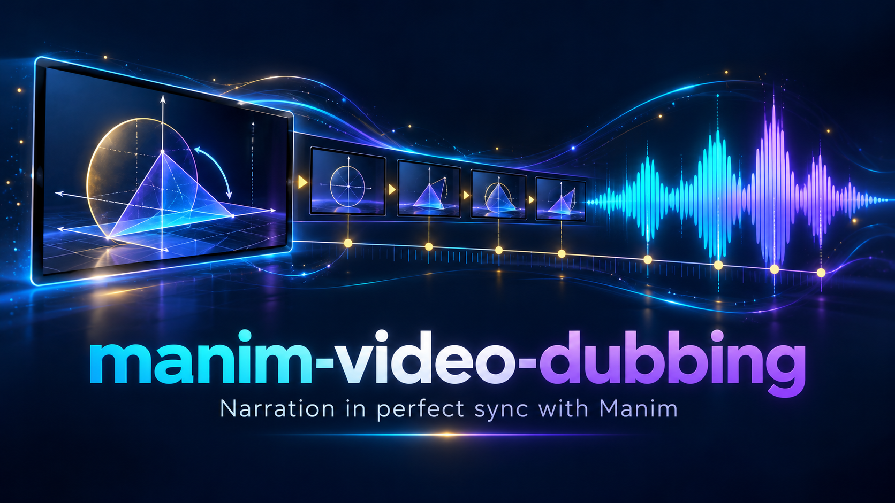

# manim-video-dubbing



给无声的 Manim 渲染视频配中文解说，做到**音画逐段精确对齐**——不是"大概同步"，而是每句话说到什么、画面就演到什么。

你只需要提供两样东西：

1. **Manim 源码**（.py，渲染这条视频的场景文件）
2. **渲染出的无声视频**（mp4）

装了这个技能的 AI 会：从源码逐动画累加重建精确时间轴 → 用帧证据校准漂移 → 写分段中文文案 → 分段 TTS 合成 → 按硬标准自我复核修正 → 交付成片 + 可微调的段落表。

## 安装

把本仓库克隆（或下载解压）到你的 AI 编码助手的技能目录：

```bash
# Claude Code / 兼容 Agent Skills 的助手
git clone https://github.com/<you>/manim-video-dubbing.git ~/.claude/skills/manim-video-dubbing

# WorkBuddy
git clone https://github.com/<you>/manim-video-dubbing.git ~/.workbuddy/skills/manim-video-dubbing
```

## 依赖

- Python 3.9+，`pip install edge-tts`（联网调用微软 TTS）
- ffmpeg / ffprobe（macOS: `brew install ffmpeg`；Ubuntu: `apt install ffmpeg`；Windows: `winget install Gyan.FFmpeg`）

## 使用

对装了本技能的 AI 说：

> 这是我的 Manim 源码 xxx.py 和渲染出的视频 xxx.mp4，帮我配中文解说，音画要对齐。

AI 会走五阶段流程：

```
① 源码重建时间轴（逐 play/wait 累加 + 硬自检）
② 帧证据定位漂移（自检差值 >0.5s 时，单帧探针逐段校准）
③ 分段中文文案（字数按画面时长预算，内容逐段对应画面）
④ 合成（edge-tts 分段配音 → 防重叠排程 → ffmpeg 无损合成）
⑤ 硬标准验收 + 自我复核修正（时长/响度/死气扫描 + 逐段抽帧对齐检查）
```

交付物：`成片 mp4` + `段落表.txt`（每段的画面起止、音频起止、文案——想改哪句，报段号即可）。

## 目录结构

```
manim-video-dubbing/
├── SKILL.md                            # 门面 + 大脑（工作流总纲）
├── references/
│   ├── timeline-reconstruction.md      # 核心手艺：源码→时间轴、漂移定位
│   ├── narration-writing.md            # 中文文案规范与 TTS 注意事项
│   └── environment-setup.md            # ffmpeg/edge-tts 安装与已知问题
├── scripts/
│   ├── dub_pipeline.py                 # 合成流水线（config 驱动）
│   └── check_sync.py                   # 独立验收器
└── examples/
    └── walkthrough.md                  # 真实项目复盘（含自检失败→修正全过程）
```

## 设计原则

- **源码是唯一权威**：段落时间轴用算术重建并硬自检，读帧只做抽查与漂移定位——目测建表会在真实项目上大面积错位
- **确定性操作进脚本**：合成与验收写成脚本，"又快又不会错"；需要判断力的部分（读源码、写文案、判读帧证据）留给 AI
- **验收不过不交付**：时长不一致、纯静音窗、段落错位都会被自动抓到并要求修复

## 适用范围

- 中文解说（默认音色：晓伊 zh-CN-XiaoyiNeural）
- Manim CE 渲染的无声视频（有原声的视频需先确认处理方式）
- macOS / Linux / Windows

## License

MIT
